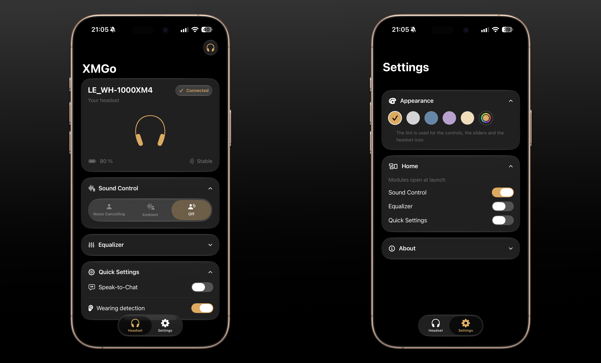

# XMGo

A lightweight, native iOS companion app for Sony **WH-1000XM4.**
Completely local, no account required.

## Features

- **Audio Modes** 
- **Speak-to-Chat** and **Wearing Detection**
- **Control Center modules** 
- P**ower-on sound mode: as Sony doesn't allow this, the app** reapplies a chosen mode every time the headset turns on, even while the app is in the background
- **Custom accent color**

## Requirements

- Sony WH-1000XM4 (can't test but might accidentally work for close models)
-  iOS 26+
## Install

TestFlight available here : 
https://testflight.apple.com/join/aQnNXEuQ

## Disclaimer

XMGo is **not affiliated with, endorsed by, or approved by Sony**.
The protocol implementation is derived from community research for educational purposes.
